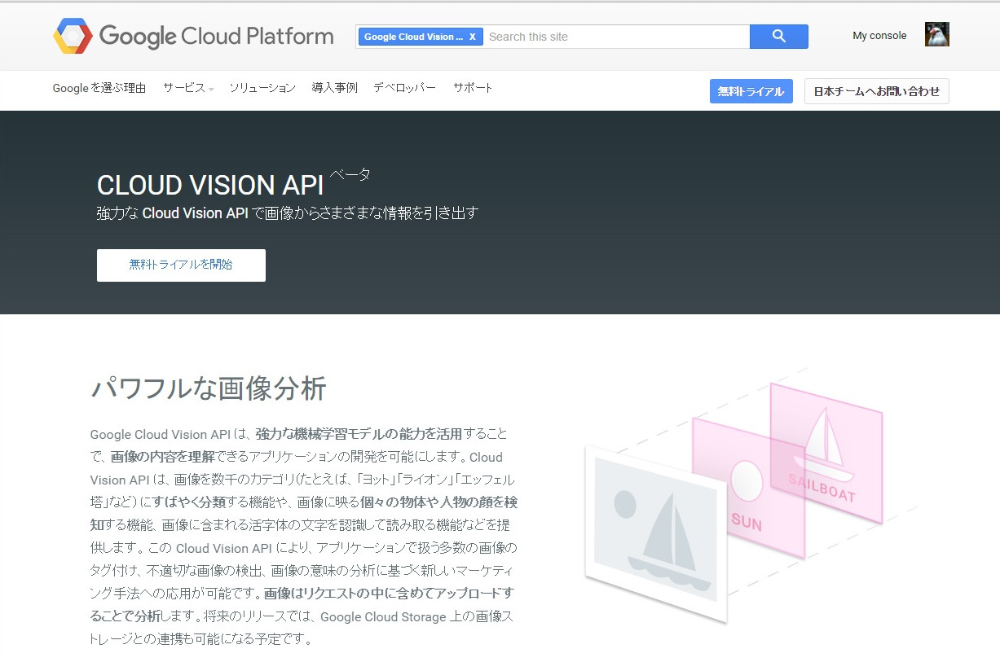
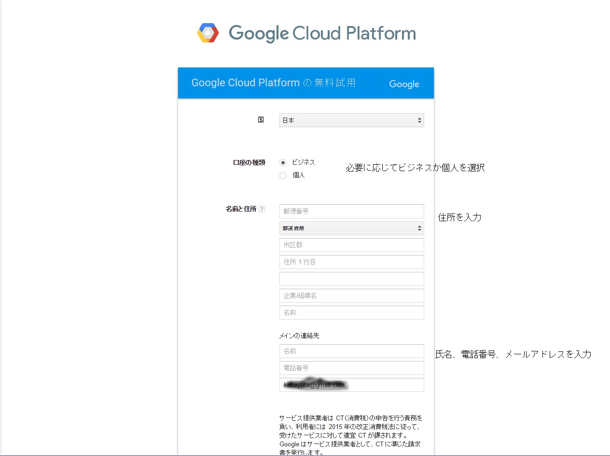
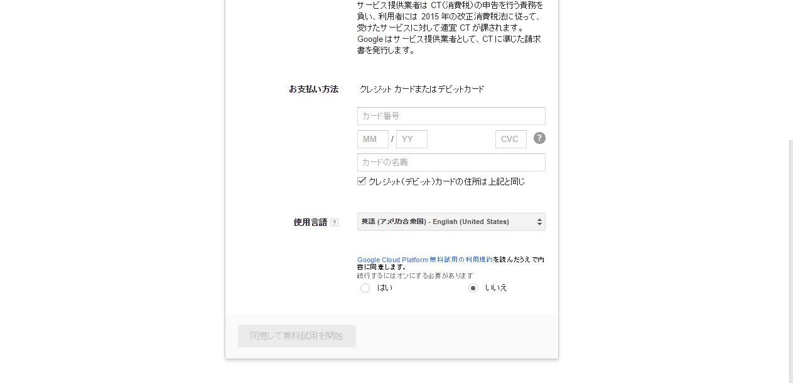
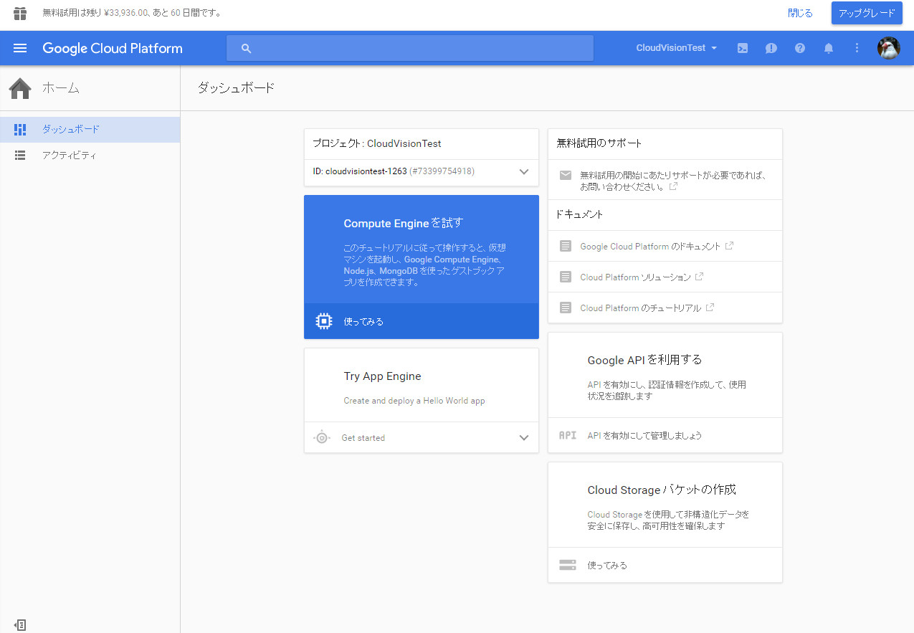
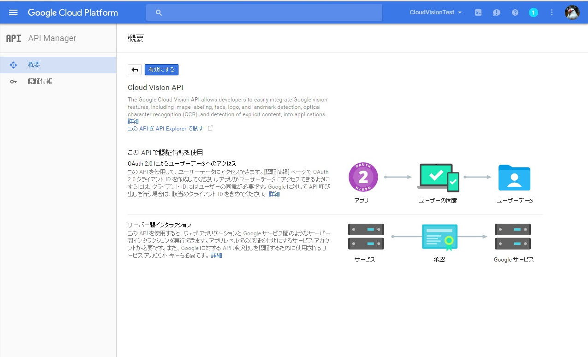
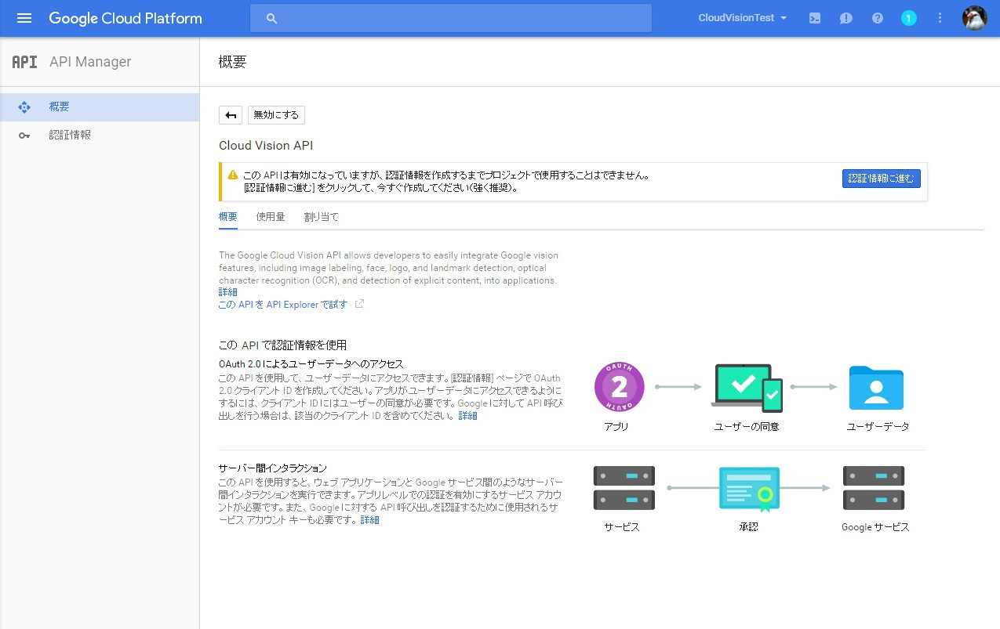
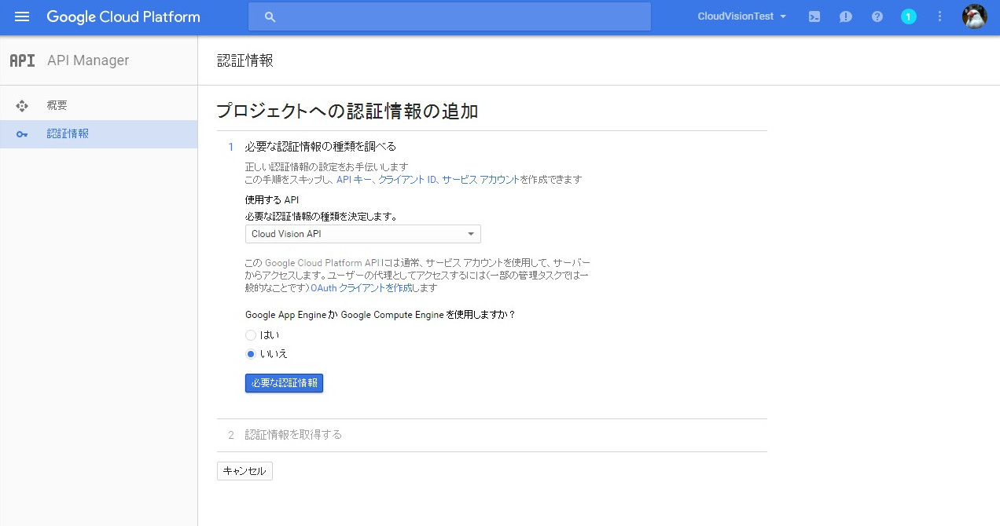
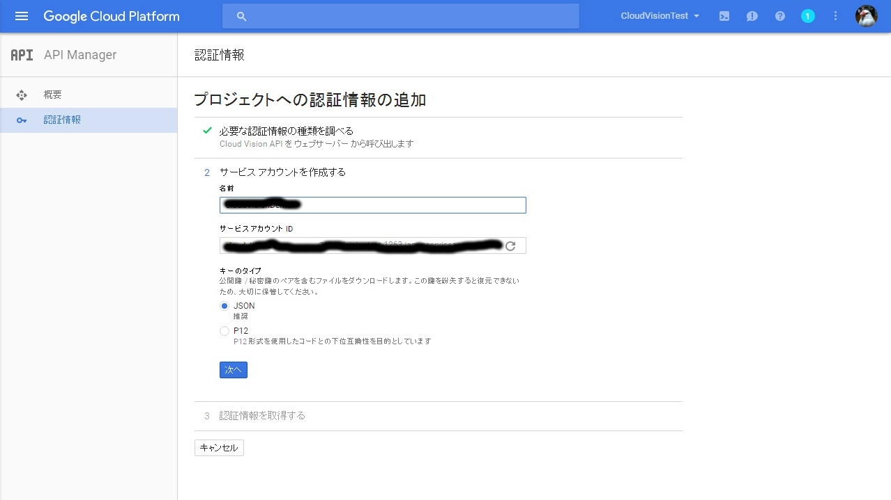
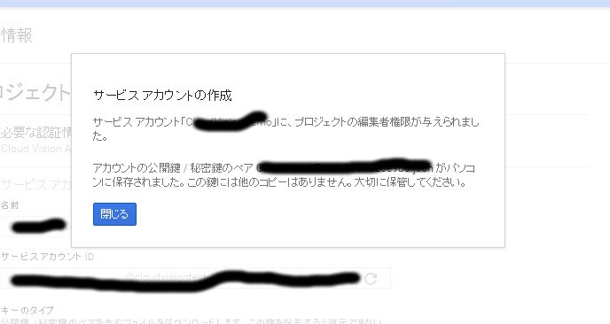

# Google Cloud Vision を試してみる

ここではFree-Trialを試してみます。
APIを試す前にまずは開発者として登録が必要になります。  
ここでクレジットカードの情報などが必要になるので、準備してください。

まず、以下のサイトにアクセスします。  
<https://cloud.google.com/vision/?hl=ja>  
すでに登録していなければ以下の画面が表示されます。  
    

ここで無料トライアルをクリックします。
課金の登録がされていないと、登録画面が出てきます。（ここは各々の登録状況によって変わります。表示されない場合は別の場所から登録できます）  
ここで必要な情報を入力していきます。

    
    

ここで必要なのが国、口座の種類、名前と住所、連絡先、カード情報になります。  
これらの情報をフォームに入力後、[ 同意して無料使用を開始 ] をクリックします。  

登録が終わるとデベロッパーコンソールに移動します。
    

次にCloudView APIを有効にします。
左上のメニューをクリックし、API Managerを選択します。
ここの検索BOXでCloud View APIと入力し、検索します。検索して出てきたらそれをクリックします。
クリックすると以下の画面が出てくるので、有効にします。  

すると認証情報の作成を即すメッセージが出てきます。  
認証情報にすすむをクリックします。

次に認証情報の作成画面が表示されます。

使用するAPIはCloud Vision APIを選択します。
次にGoogle App EngineかCompute Engineを使用するかの選択があります。ここは各々の状況で選択すればよいでしょう。  
選択したら[必要な認証情報]をクリックします。
すると以下の画面が表示されます。

この画面で認証情報の追加を行います。名前を入れるとサービスアカウント名は勝手に入ります。  
キーのタイプはJSONとP12のいずれかが選べます。
どっちでもいいですが、ここではとりあえずJSONで選択しておきます。  
ここで次へをクリックすると以下の画面が表示され、同時にキーが自動でダウンロードされます。

以上で基本的な登録はおしまいです。
続いて、実際にAPIを使うための設定に移りましょう。
