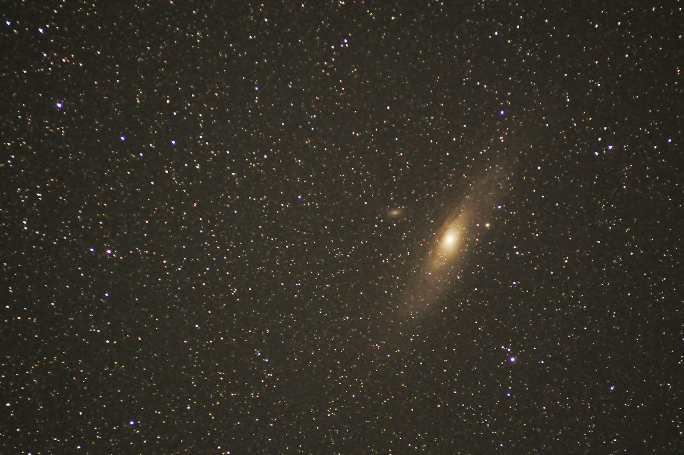

# 検出方法と応答の違い

## LABEL_DETECTION
画像の種類を検出します。
このような画像を認識させると  
  
こんな応答が戻ってきます。

```
"labelAnnotations": [
   {
     "mid": "/m/01d9ll",
     "description": "astronomical object",
     "score": 0.94117647
   },
   {
     "mid": "/m/039b5",
     "description": "galaxy",
     "score": 0.93211818
   },
   {
     "mid": "/m/0jg24",
     "description": "image",
     "score": 0.89089781
   },
   {
     "mid": "/m/06ngk",
     "description": "star",
     "score": 0.67042637
   },
   {
     "mid": "/m/0dc_v",
     "description": "astronomy",
     "score": 0.65715992
   },
   {
     "mid": "/m/07v7c",
     "description": "universe",
     "score": 0.5518617
   },
   {
     "mid": "/m/01833w",
     "description": "outer space",
     "score": 0.51442331
   },
   {
     "mid": "/m/05fny",
     "description": "nebula",
     "score": 0.51413369
   }
 ]
```
* mid
ナレッジグラフ用のIDが入ります。ナレッジグラフに関してはこちらを参照してください。
https://developers.google.com/knowledge-graph/#knowledge_graph_entities

* description
検出した種類（カテゴリ）が入ります。

* score
確からしさが入ります。0から1までの間の数字がはいり、1に近いほうが確からしいということになります。  

この画像からは、star, universe, astronomy, outer space, nebula, galaxyとか入っているので、ほぼ正しく認識できているといえます。  
さすがにアンドロメダとはわかりませんでした。（人間でも判別は難しいです。。。）

## FACE_DETECTION
FACE_DETECTIONで戻ってくる応答ファイルの例を示します。

```
{
  "responses": [
    {
      "faceAnnotations": [
        {
          "boundingPoly": {
            "vertices": [
              {
                "x": 214,
                "y": 160
              },
              {
                "x": 426,
                "y": 160
              },
              {
                "x": 426,
                "y": 407
              },
              {
                "x": 214,
                "y": 407
              }
            ]
          },
          "fdBoundingPoly": {
            "vertices": [
              {
                "x": 247,
                "y": 233
              },
              {
                "x": 402,
                "y": 233
              },
              {
                "x": 402,
                "y": 388
              },
              {
                "x": 247,
                "y": 388
              }
            ]
          },
          "landmarks": [
            {
              "type": "LEFT_EYE",
              "position": {
                "x": 296.26749,
                "y": 281.19263,
                "z": 0.00062860135
              }
            },
            {
              "type": "RIGHT_EYE",
              "position": {
                "x": 357.72458,
                "y": 283.11472,
                "z": 6.0108738
              }
            },
            {
              "type": "LEFT_OF_LEFT_EYEBROW",
              "position": {
                "x": 273.8656,
                "y": 262.80933,
                "z": 1.2879153
              }
            },
            {
              "type": "RIGHT_OF_LEFT_EYEBROW",
              "position": {
                "x": 313.74454,
                "y": 268.01389,
                "z": -13.471269
              }
            },
            {
              "type": "LEFT_OF_RIGHT_EYEBROW",
              "position": {
                "x": 345.18594,
                "y": 270.31348,
                "z": -10.271013
              }
            },
            {
              "type": "RIGHT_OF_RIGHT_EYEBROW",
              "position": {
                "x": 381.35654,
                "y": 269.07632,
                "z": 11.703918
              }
            },
            {
              "type": "MIDPOINT_BETWEEN_EYES",
              "position": {
                "x": 328.92267,
                "y": 283.19095,
                "z": -10.503561
              }
            },
            {
              "type": "NOSE_TIP",
              "position": {
                "x": 328.43451,
                "y": 322.56958,
                "z": -22.933422
              }
            },
            {
              "type": "UPPER_LIP",
              "position": {
                "x": 326.09232,
                "y": 343.97974,
                "z": -4.2506247
              }
            },
            {
              "type": "LOWER_LIP",
              "position": {
                "x": 323.5791,
                "y": 361.6037,
                "z": 3.4246917
              }
            },
            {
              "type": "MOUTH_LEFT",
              "position": {
                "x": 295.06638,
                "y": 345.25696,
                "z": 12.454833
              }
            },
            {
              "type": "MOUTH_RIGHT",
              "position": {
                "x": 352.90332,
                "y": 349.47491,
                "z": 17.727896
              }
            },
            {
              "type": "MOUTH_CENTER",
              "position": {
                "x": 324.70032,
                "y": 352.01227,
                "z": 2.0202057
              }
            },
            {
              "type": "NOSE_BOTTOM_RIGHT",
              "position": {
                "x": 345.36197,
                "y": 325.85617,
                "z": 4.5601273
              }
            },
            {
              "type": "NOSE_BOTTOM_LEFT",
              "position": {
                "x": 307.6217,
                "y": 324.18994,
                "z": 0.77486467
              }
            },
            {
              "type": "NOSE_BOTTOM_CENTER",
              "position": {
                "x": 327.35867,
                "y": 331.57214,
                "z": -6.6434293
              }
            },
            {
              "type": "LEFT_EYE_TOP_BOUNDARY",
              "position": {
                "x": 296.25705,
                "y": 277.81195,
                "z": -5.0446014
              }
            },
            {
              "type": "LEFT_EYE_RIGHT_CORNER",
              "position": {
                "x": 308.39551,
                "y": 284.27414,
                "z": 1.6764798
              }
            },
            {
              "type": "LEFT_EYE_BOTTOM_BOUNDARY",
              "position": {
                "x": 295.0361,
                "y": 285.43021,
                "z": 0.10243175
              }
            },
            {
              "type": "LEFT_EYE_LEFT_CORNER",
              "position": {
                "x": 282.38351,
                "y": 280.54169,
                "z": 4.5632339
              }
            },
            {
              "type": "LEFT_EYE_PUPIL",
              "position": {
                "x": 294.78107,
                "y": 281.74789,
                "z": -1.8182046
              }
            },
            {
              "type": "RIGHT_EYE_TOP_BOUNDARY",
              "position": {
                "x": 360.19513,
                "y": 280.50598,
                "z": 1.2428024
              }
            },
            {
              "type": "RIGHT_EYE_RIGHT_CORNER",
              "position": {
                "x": 371.95065,
                "y": 284.09021,
                "z": 13.380525
              }
            },
            {
              "type": "RIGHT_EYE_BOTTOM_BOUNDARY",
              "position": {
                "x": 358.7605,
                "y": 287.57568,
                "z": 6.2821479
              }
            },
            {
              "type": "RIGHT_EYE_LEFT_CORNER",
              "position": {
                "x": 347.52414,
                "y": 285.04211,
                "z": 5.4341044
              }
            },
            {
              "type": "RIGHT_EYE_PUPIL",
              "position": {
                "x": 360.44312,
                "y": 284.53467,
                "z": 4.5789361
              }
            },
            {
              "type": "LEFT_EYEBROW_UPPER_MIDPOINT",
              "position": {
                "x": 294.92679,
                "y": 259.65509,
                "z": -11.656351
              }
            },
            {
              "type": "RIGHT_EYEBROW_UPPER_MIDPOINT",
              "position": {
                "x": 364.34512,
                "y": 262.69022,
                "z": -4.8375392
              }
            },
            {
              "type": "LEFT_EAR_TRAGION",
              "position": {
                "x": 246.02682,
                "y": 297.27167,
                "z": 79.213585
              }
            },
            {
              "type": "RIGHT_EAR_TRAGION",
              "position": {
                "x": 391.38843,
                "y": 303.42355,
                "z": 93.447243
              }
            },
            {
              "type": "FOREHEAD_GLABELLA",
              "position": {
                "x": 329.91644,
                "y": 269.28671,
                "z": -14.379084
              }
            },
            {
              "type": "CHIN_GNATHION",
              "position": {
                "x": 321.60529,
                "y": 391.056,
                "z": 17.428719
              }
            },
            {
              "type": "CHIN_LEFT_GONION",
              "position": {
                "x": 253.01466,
                "y": 342.5513,
                "z": 60.93988
              }
            },
            {
              "type": "CHIN_RIGHT_GONION",
              "position": {
                "x": 384.30954,
                "y": 348.1611,
                "z": 73.840988
              }
            }
          ],
          "rollAngle": 3.3592384,
          "panAngle": 5.6808867,
          "tiltAngle": -9.4180737,
          "detectionConfidence": 0.99928665,
          "landmarkingConfidence": 0.74517334,
          "joyLikelihood": "VERY_LIKELY",
          "sorrowLikelihood": "VERY_UNLIKELY",
          "angerLikelihood": "VERY_UNLIKELY",
          "surpriseLikelihood": "VERY_UNLIKELY",
          "underExposedLikelihood": "VERY_UNLIKELY",
          "blurredLikelihood": "VERY_UNLIKELY",
          "headwearLikelihood": "VERY_UNLIKELY"
        }
      ]
    }
  ]
}
```

* boundingPoly  
検出した顔の境界情報が格納されます。2次元のポリゴンで指定され、後述するverticesで頂点の位置が指定されます。  

* fdBoundingPoly  
検出した顔の肌の部分の境界情報が格納されます。2次元のポリゴンで指定され、後述するverticesで頂点の位置が指定されます。  

* vertices  
boundingPolyで検出したポリゴンの頂点の座標です。2次元座標で、x, yの要素で構成されます。  

* landmarks  
顔の特徴位置が格納されます。特徴点はtype, positionというobjectで構成されます。  
検出できるものは目、鼻、口、顎、耳などの位置がわかります。

* rollAngle  
顔が横を向いている角度が格納されます。  

* panAngle  
顔が傾いている角度が格納されます。  

* tiltAngle  
顔が上を向いているか、うつむいているかの角度が格納されます。

* detectionConfidence  
顔検出の信頼度が格納されます。0から1の間で値が入ります。  

* landmarkingConfidence  
顔の特徴点検出の信頼度が格納されます。これも0から1の間で値が入ります。

* ほにゃららLikelihood  
顔の表情検出した結果が格納されます。これらは以下のような値で表現されます。  

|Enum value	|Description|
|:----------|-----------|
|UNKNOWN	| Unknown likelihood.|
|VERY_UNLIKELY	|The image very unlikely belongs to the vertical specified.|
|UNLIKELY	|The image unlikely belongs to the vertical specified.|
|POSSIBLE	|The image possibly belongs to the vertical specified.|
|LIKELY	|The image likely belongs to the vertical specified.|
|VERY_LIKELY	|The image very likely belongs to the vertical specified.|

検出できる表情は以下の通りです。

|Field name	|	Description |
|:--------------|----------------|
|joyLikelihood	|	喜んでいそう|
|sorrowLikelihood	|	悲しんでいそう|
|angerLikelihood	|	怒っていそう|
|surpriseLikelihood	|	驚いていそう|
|underExposedLikelihood	|	写真の露光が不足していそう |
|blurredLikelihood	|	写真がぼけている |
|headwearLikelihood	|	帽子のようだ　|

先ほどの写真の解析結果を見ると、ほぼ正面を見た状態で顔の傾きなども少なく、位置検出精度も高い状態で、喜んでいる状態、と認識されています。   

実際に解析するためのコードを以下に示します。

```
# FACE_DETECTION
if ("faceAnnotations" in response) == True:
    print "------------------------------"
    print "Features: FACE_DETECTION"
    type = response['faceAnnotations']     # ここのtypeはlistで取得される
    for item in type:                       # itemはdict形式になっている

        boundingPoly = item['boundingPoly']['vertices']                
        print "boundingPoly"
        for position in boundingPoly:
            print "(x,y)=" + str(position['x']) + "," + str(position['y'])

        fdBoundingPoly = item['fdBoundingPoly']['vertices']                
        print "fdBoundingPoly"
        for position in fdBoundingPoly:
            print "(x,y)=" + str(position['x']) + "," + str(position['y'])

        landmarks = item['landmarks']                
        print "landmarks"
        for mark in landmarks:
            print "Type=" + mark['type'] + "   ( x, y, z)= (" + str(mark['position']['x']) + "," + str(mark['position']['y']) + "," + str(mark['position']['z']) + ")"

        print "rollAngle=" + str(item['rollAngle'])
        print "panAngle=" + str(item['panAngle'])
        print "tiltAngle=" + str(item['tiltAngle'])
        print "detectionConfidence=" + str(item['detectionConfidence'])
        print "landmarkingConfidence=" + str(item['landmarkingConfidence'])
        print "joyLikelihood = " + item['joyLikelihood']
        print "sorrowLikelihood = " + item['sorrowLikelihood']
        print "angerLikelihood = " + item['angerLikelihood']
        print "surpriseLikelihood = " + item['surpriseLikelihood']
        print "underExposedLikelihood = " + item['underExposedLikelihood']
        print "blurredLikelihood = " + item['blurredLikelihood']
        print "headwearLikelihood = " + item['headwearLikelihood']
```
