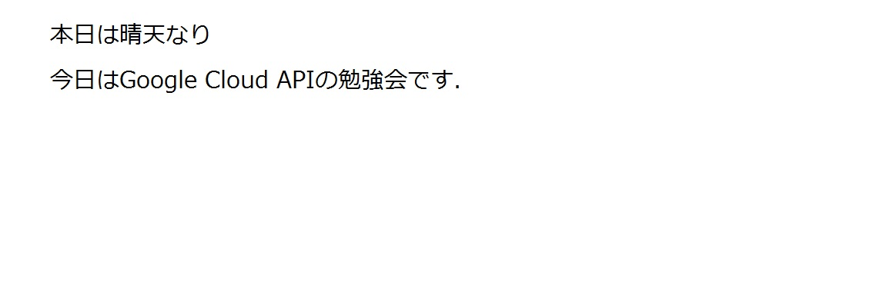

# 検出方法と応答の違い

## TEXT_DETECTION
TEXT_DETECTIONはいわゆるOCRです。手書き文字などを認識できます。
TEXT_DETECTIONで戻ってくる応答ファイルの例を示します。
このような画像ファイルを認識させた場合、以下のような応答ファイルが戻ります。  


```
"textAnnotations": [
  {
    "locale": "ja",
    "description": "本日は晴天なり\n今日はGoogle Cloud APIの勉強会です.\n",
    "boundingPoly": {
      "vertices": [
        {
          "x": 64,
          "y": 30
        },
        {
          "x": 595,
          "y": 30
        },
        {
          "x": 595,
          "y": 120
        },
        {
          "x": 64,
          "y": 120
        }
      ]
    }
  },
  {
    "description": "本日",
    "boundingPoly": {
      "vertices": [
        {
          "x": 64,
          "y": 30
        },
        {
          "x": 120,
          "y": 30
        },
        {
          "x": 120,
          "y": 55
        },
        {
          "x": 64,
          "y": 55
        }
      ]
    }
  },
  {
    "description": "は",
    "boundingPoly": {
      "vertices": [
        {
          "x": 126,
          "y": 32
        },
        {
          "x": 153,
          "y": 32
        },
        {
          "x": 153,
          "y": 55
        },
        {
          "x": 126,
          "y": 55
        }
      ]
    }
  },
  {
    "description": "晴天",
    "boundingPoly": {
      "vertices": [
        {
          "x": 155,
          "y": 30
        },
        {
          "x": 212,
          "y": 30
        },
        {
          "x": 212,
          "y": 56
        },
        {
          "x": 155,
          "y": 56
        }
      ]
    }
  },
  {
    "description": "なり",
    "boundingPoly": {
      "vertices": [
        {
          "x": 215,
          "y": 31
        },
        {
          "x": 270,
          "y": 31
        },
        {
          "x": 270,
          "y": 56
        },
        {
          "x": 215,
          "y": 56
        }
      ]
    }
  },
  {
    "description": "今日",
    "boundingPoly": {
      "vertices": [
        {
          "x": 65,
          "y": 89
        },
        {
          "x": 119,
          "y": 89
        },
        {
          "x": 119,
          "y": 115
        },
        {
          "x": 65,
          "y": 115
        }
      ]
    }
  },
  {
    "description": "は",
    "boundingPoly": {
      "vertices": [
        {
          "x": 127,
          "y": 91
        },
        {
          "x": 153,
          "y": 91
        },
        {
          "x": 153,
          "y": 115
        },
        {
          "x": 127,
          "y": 115
        }
      ]
    }
  },
  {
    "description": "Google",
    "boundingPoly": {
      "vertices": [
        {
          "x": 155,
          "y": 90
        },
        {
          "x": 253,
          "y": 90
        },
        {
          "x": 253,
          "y": 120
        },
        {
          "x": 155,
          "y": 120
        }
      ]
    }
  },
  {
    "description": "Cloud",
    "boundingPoly": {
      "vertices": [
        {
          "x": 265,
          "y": 90
        },
        {
          "x": 345,
          "y": 90
        },
        {
          "x": 345,
          "y": 114
        },
        {
          "x": 265,
          "y": 114
        }
      ]
    }
  },
  {
    "description": "API",
    "boundingPoly": {
      "vertices": [
        {
          "x": 358,
          "y": 90
        },
        {
          "x": 406,
          "y": 90
        },
        {
          "x": 406,
          "y": 114
        },
        {
          "x": 358,
          "y": 114
        }
      ]
    }
  },
  {
    "description": "の",
    "boundingPoly": {
      "vertices": [
        {
          "x": 409,
          "y": 91
        },
        {
          "x": 436,
          "y": 91
        },
        {
          "x": 436,
          "y": 114
        },
        {
          "x": 409,
          "y": 114
        }
      ]
    }
  },
  {
    "description": "勉強",
    "boundingPoly": {
      "vertices": [
        {
          "x": 438,
          "y": 89
        },
        {
          "x": 496,
          "y": 89
        },
        {
          "x": 496,
          "y": 116
        },
        {
          "x": 438,
          "y": 116
        }
      ]
    }
  },
  {
    "description": "会",
    "boundingPoly": {
      "vertices": [
        {
          "x": 499,
          "y": 89
        },
        {
          "x": 527,
          "y": 89
        },
        {
          "x": 527,
          "y": 115
        },
        {
          "x": 499,
          "y": 115
        }
      ]
    }
  },
  {
    "description": "です",
    "boundingPoly": {
      "vertices": [
        {
          "x": 529,
          "y": 90
        },
        {
          "x": 587,
          "y": 90
        },
        {
          "x": 587,
          "y": 115
        },
        {
          "x": 529,
          "y": 115
        }
      ]
    }
  },
  {
    "description": ".",
    "boundingPoly": {
      "vertices": [
        {
          "x": 590,
          "y": 109
        },
        {
          "x": 595,
          "y": 109
        },
        {
          "x": 595,
          "y": 114
        },
        {
          "x": 590,
          "y": 114
        }
      ]
    }
  }
]

```
* locale
OCRで認識した文字列の言語情報が入ります。今回の場合は日本語なので、"ja"が入っています。


* description  
OCRで認識した文字列が入ります。複数行の場合は改行コードが入ってきます。  

* boundingPoly  
検出したロゴの境界情報が格納されます。2次元のポリゴンで指定され、後述するverticesで頂点の位置が指定されます。  

* vertices  
boundingPolyで検出したポリゴンの頂点の座標です。2次元座標で、x, yの要素で構成されます。  

TEXT_DETECTIONでは単純にOCRを行った文字列のほかに、構文解析をしてくれるようです。
これは便利。（ない場合は別にMecabとかで解析する必要があるので、一発でできると楽ですね）

## SAFE_SEARCH_DETECTION
18禁な画像かどうかを判定してくれます。
このような応答が戻ってきます。

```
"safeSearchAnnotation": {
  "adult": "VERY_UNLIKELY",
  "spoof": "VERY_UNLIKELY",
  "medical": "UNLIKELY",
  "violence": "UNLIKELY"
}
```
* adult
　どれだけ18禁っぽいか

* spoof
　パクリ具合

* medical
　医療系っぽいか？例えば内臓みたいな、医学的には問題ないけど見た目グロっぽさ。

* violence
　暴力っぽさ

これらの度合いはLikelihoodで表されます。

* UNKNOWN	判定不能。
* VERY_UNLIKELY	非常に低いレベル。
* UNLIKELY	低いレベル。
* POSSIBLE	そうだと言うことができるレベル。
* LIKELY	高いレベル。
* VERY_LIKELY	非常に高いレベル。

## IMAGE_PROPERTIES
画像の色に関する情報を取得します。  
  
このようなオレンジ一色の画像を使うとこのような応答が戻ります。  

```
"dominantColors": {
  "colors": [
    {
      "color": {
        "red": 255,
        "green": 127,
        "blue": 38
      },
      "score": 1,
      "pixelFraction": 1
    }
  ]

  ```
  * colors
  　含まれる色の情報が入ります。

  * score
  　検出の信頼度を表します。0-1までの間で数字が入ります。

  * pixelFraction
  　ドットの大きさを表します。

   * color
  　色のRGB情報が入ります。それぞれred, green, blueにRGBの値が入ります。

  
